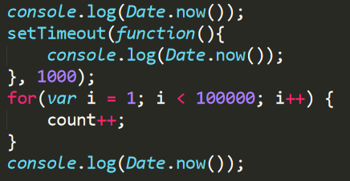

## JS单线程下的异步
最近在做项目的时候，发现很多人对前端异步的了解都有些模糊（包括自己），所以写下这篇文章记录自己学习和整理。这是一篇学习文章，如有问题，请指出，不能祸害大家，共同进步。

### 单线程的JS
我们都知道js引擎是运行在浏览器的单线程，这大概是远古时代设计的问题（也许是保持页面的简单，比如两个线程同时在操作同一个dom，浏览器需要去如何操作？产生了后期同步的代价），所以我们写得JS代码都是被同一个JS引擎所运行，因此，运行在前面的代码肯定会比运行在后面的代码先执行，自上而下的进行代码阻塞。  

这时候，如果某一个js操作时间很长，那么之后的代码就会出现阻塞，用户的页面也就会出现卡顿和卡死的情况。因此JS单线程实现了异步，允许某些代码的执行不会阻塞之后的代码。  

在这里摘自一下百度百科对异步的定义：异步指的是让CPU暂时搁置当前请求的响应,处理下一个请求,当通过轮询或其他方式得到回调通知后,开始运行。那么JS是怎么做到这些的呢，就是通过大名鼎鼎的事件循环机制。  

### 事件循环（EventLoop）
模型图  
  
在讲解事件循环的时候，我们先了解一些概念。

- 产生堆（heap）和函数栈（stack）  
    产生堆就是我们会为对象分配的内存。  
    函数栈是我们在调用函数的时候产生的，函数调用可以使用异步api。

- 消息队列（事件队列，任务队列）  
    消息队列是一个由回调函数组成的队列，先进先出。

事件循环流程：  

1. js引擎根据函数栈的顺序调用，当调用到一个异步api操作的时候（比如setTimeout定时器,ajax或者dom事件），浏览器会自动去识别这个api是否异步的。比如是一个定时器任务，当setTimeout出现时，浏览器就知道这是个异步api(嘿，这家伙是那美克星人)。浏览器中的异步api都是事先浏览器所知道的（我们并不能创造异步api）。   
    
2. 当异步api被识别之后，js引擎就会去处理异步api，这里的处理不是自己去处理，而是请一些其他浏览器线程进行处理（那美克星人全部到那美克星去），比如有浏览器定时器线程、dom操作线程或者其他种种，浏览器定时器线程会帮助我们进行计时，ajax线程可以帮我们处理http请求。所以有人说js单线程异步是一种假象，它其实依然需要其他一些线程的协助完成任务的处理。通过这种方式，js引擎就可以处理接下来代码，从而达到异步的效果。  
  
    
    
  从上面的运行结果我们可以看出，当浏览器遇到异步api的时候，他就会把这个任务的处理交给异步线程，而不是等所有的同步代码都运行完毕之后才交付。  
   
3. 当js引擎将线程代码运行完毕，这时候所有的异步api的任务都已经交给其他线程执行（小学生的作业已经发了）。js就会去不断循环任务队列，去读取里面的任务。这时候如如果异步操作完成（小学生交作业啦），js线程就会收到通知，返回通知同样是异步api所必须具有的。在通知返回之后，js引擎将对应的回调函数或执行动作添加至异步队列。不过这个消息队列是阻塞的，必须要等到他的执行时间才可以执行，因此定时器不一定在相应的时间节点执行，必须要等到它的之前的任务完成之后，任务才会被执行。如此不断地循环往复，day and day。
  
  

### 对于单线程异步的一点点感想
js中的异步，实现的是可以将异步api发出同时获取异步api的返回结果的机制，同时通过事件循环保证消息队列在不断被运转。在node，或者python上我们也可以看到相似的事件循环机制。

但是我还是想说，都是假的，童话里说的都是骗人的。

1. 因为js只有一个线程，如果要实现异步，必须要其他线程的帮助和协同。如果你要问我异步和线程有什么关系，我觉得异步必须要两个以上线程的参与。

2. 同样因为是单线程，消息队列中任务的运行同样是阻塞的，js只是以它超高的骗术让我们觉得似乎他们好像是被同时运行的，但他们从来都是一个任务接一个任务，只是运行的时间很短。

### 参考链接
感谢以下文章，接下来准备写一个前端异步解决方案的比较  
[JavaScript 运行机制详解：再谈Event Loop](http://www.ruanyifeng.com/blog/2014/10/event-loop.html)  
[javascript 运行机制 EventLoop](https://www.jianshu.com/p/10714ad38f9a) 
[并发模型与事件循环](https://developer.mozilla.org/zh-CN/docs/Web/JavaScript/EventLoop) 

